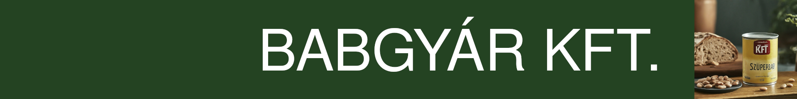
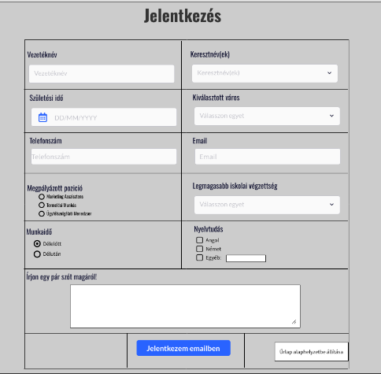

Főoldal
===
# Üdvözöljük a Babgyár Kft. honlapján!

<figure>
  
  <figcaption>Fejléc képe</figcaption>
</figure> 
## Fedezze fel velünk az ízek világát!

Már évtizedek óta büszkén szállítjuk a legfrissebb és legízletesebb babkonzerveket világszerte. Szakértelmünk és elkötelezettségünk a minőség iránt garantálja, hogy minden egyes falat, amit készítünk, kiváló ízű és tápláló legyen.

### Miért válasszon minket?

- **Minőség:** A Babgyár Kft.-nél a minőség mindennél fontosabb. Szigorú minőségellenőrzési folyamataink biztosítják, hogy termékeink mindig kifogástalanok legyenek.
- **Frissesség:** Friss alapanyagokból készítjük termékeinket, hogy Ön mindig a legfinomabb ízeket élvezhesse.
- **Hagyomány és innováció:** Hagyományos recepteket és modern technológiákat ötvözve hozunk létre olyan termékeket, amelyek minden igényt kielégítenek.

## Legfrissebb hírek és termékek

Kövesse weboldalunkat, hogy értesüljön legújabb híreinkről, termékeinkről és különleges ajánlatainkról!

Várjuk Önt szeretettel a Babgyár Kft.-nél!

## Termékek
### Friss Zöldségekkel Gazdagított Babkonzervek
Kiváló minőségű, friss zöldségekkel gazdagított babkonzervek, melyek frissességet és ízletességet garantálnak minden egyes falatban. A gondosan válogatott alapanyagokkal készült konzerveink ideálisak mind az egészséges étrend részeként, mind pedig különféle ételkészítési lehetőségekhez.

### Natúr Babkonzervek
A natúr babkonzervek egyszerűsége és tisztasága az alapanyagok frissességét hangsúlyozza. Tökéletes választás azok számára, akik a lehető legkevesebb feldolgozott élelmiszert keresik, és saját receptjeikben szeretnék felhasználni a babot.

### Fűszeres Babkonzervek
Az ínyenceknek szánt fűszeres babkonzervek különleges ízvilágot kínálnak. A fűszerekkel gazdagított babok egyedi és karakteres ízekkel rendelkeznek, amelyek kiválóan harmonizálnak más ételekkel és fogásokkal.

### Vegán és Vegetáriánus Opciók
Különféle vegán és vegetáriánus babkonzervek széles választéka áll rendelkezésre azoknak, akik húsmentes étrendet követnek vagy különleges táplálkozási igényekkel rendelkeznek. Ezek az étrendek teljes értékű fehérjeforrásokat biztosítanak, miközben ízletes és tápláló fogásokat tesznek lehetővé.

### Különleges Kóstolók és Készletek
Különleges kóstolók és ajándék készletek kaphatók, amelyek ideálisak ajándékként vagy saját ínyencei kényeztetésére. Ezek a készletek válogatott termékeket tartalmaznak, hogy Ön és szerettei élvezhessék a Babgyár Kft. legfinomabb termékeit.

Minden Babgyár Kft. termék friss, minőségi alapanyagokból készül, és szigorú minőségellenőrzési folyamatokon megy keresztül, hogy Ön mindig a legjobbat kapja az asztalán.

---

|**Kapcsolat információk:**             |**Navigációs linkek:**|
|---                                   |---|
|- Cím: Babgyár út 123, Pécsvárad, 1234 | [Rólunk](#Rólunk)|
|- Telefon: +36 1 234 5678              | [Kapcsolat](#Kapcsolat)|
|- E-mail: info@babgyar.hu              | [Jelentkezés](#Jelentkezés)|

**Copyright © 2024 Babgyár Kft.**

---
Rólunk oldal
===
# Rólunk

# Rólunk

## Üdvözöljük a Babgyár Kft.-nél!

Mi egy családi vállalkozás vagyunk, amely több mint 30 éve áll az Ön szolgálatában a legfinomabb babkonzervekkel. Azt hisszük, hogy az egészséges és tápláló ételek nem csak jók az Ön számára, de kiválóak az egész család számára.

<figure>
  
  <figcaption>A gyár épülete</figcaption>
</figure>

[itt fog elhelyezkedni a reklam.mp4]

## Küldetésünk és Értékeink

Célunk, hogy minőségi és tápláló ételeket kínáljunk ügyfeleinknek, miközben támogatjuk az egészséges életmódot és az élvezetes táplálkozást. Az általunk készített babkonzervek friss, gondosan válogatott alapanyagokból készülnek, és minden egyes termékünk mögött azonos elkötelezettség áll: a minőség és az íz.

**Értékeink:**
- *Minőség*: Szigorú minőségellenőrzési folyamatokat alkalmazunk, hogy minden termékünk kifogástalan legyen.
- *Frissesség*: Friss, kiváló minőségű alapanyagokból készítjük termékeinket, hogy Ön mindig a legjobbat kapja az asztalán.
- *Hagyomány*: Büszkék vagyunk arra, hogy hosszú múltra tekintünk vissza családi receptek és hagyományok ápolásában.

<figure>
  
  <figcaption>A gyártási folyamat</figcaption>
</figure>

## Fenntarthatóság

Nem csak a minőség és az íz fontos számunkra, hanem a fenntarthatóság is. Azon dolgozunk, hogy fenntarthatóbb gyártási folyamatokat alakítsunk ki, és csökkentsük a környezeti lábnyomunkat. Termékeink csomagolásában is igyekszünk fenntartható anyagokat és megoldásokat alkalmazni.

<figure>
  
  <figcaption>A gyár belseje</figcaption>
</figure>

## Csatlakozzon Hozzánk!

Köszönjük, hogy érdeklődik rólunk és termékeinkről. Reméljük, hogy hamarosan ügyfelünk lehetünk, és Önt is kiszolgálhatjuk a legfinomabb babkonzervekkel.

Ha bármilyen kérdése van, ne habozzon felvenni velünk a kapcsolatot! Ügyfélszolgálatunk készséggel áll rendelkezésére.

---

|**Kapcsolat információk:**             |**Navigációs linkek:**|
|---                                   |---|
|- Cím: Babgyár út 123, Pécsvárad, 1234 | [Rólunk](#Rólunk)|
|- Telefon: +36 1 234 5678              | [Kapcsolat](#Kapcsolat)|
|- E-mail: info@babgyar.hu              | [Jelentkezés](#Jelentkezés)|

**Copyright © 2024 Babgyár Kft.**

---
# Kapcsolatok

## Székhely

**Cím:** Babgyár Kft.  
Babgyár út 123, Pécsvárad, 1234

## Kapcsolatfelvétel

**Telefon:** +36 1 234 5678  
**E-mail:** info@babgyar.hu

## Kapcsolattartók

Ha kérdése vagy észrevétele van, kérjük, vegye fel a kapcsolatot az alábbi kapcsolattartókkal:

### 1. Kereskedelmi Igazgató: Álmos Péter
- **Telefon:** +36 30 123 4567
- **E-mail:** peter.almos@babgyar.hu

### 2. Ügyfélszolgálati Vezető: Kiss Katalin
- **Telefon:** +36 30 987 6543
- **E-mail:** katalin.kiss@babgyar.hu

### 3. Vevőkapcsolati Menedzser: Nagy Gábor
- **Telefon:** +36 30 555 1234
- **E-mail:** gabor.nagy@babgyar.hu

Kérjük, ne habozzon felvenni a kapcsolatot bármelyik kapcsolattartónkkal kérdéseivel vagy észrevételeivel kapcsolatban. Örömmel állunk rendelkezésére!
<figure>

<figcaption>A csapat</figcaption>
</figure>

---

|**Kapcsolat információk:**             |**Navigációs linkek:**|
|---                                   |---|
|- Cím: Babgyár út 123, Pécsvárad, 1234 | [Rólunk](#Rólunk)|
|- Telefon: +36 1 234 5678              | [Kapcsolat](#Kapcsolat)|
|- E-mail: info@babgyar.hu              | [Jelentkezés](#Jelentkezés)|

**Copyright © 2024 Babgyár Kft.**

---
# Jelentkezés

---

|**Kapcsolat információk:**             |**Navigációs linkek:**|
|---                                   |---|
|- Cím: Babgyár út 123, Pécsvárad, 1234 | [Rólunk](#Rólunk)|
|- Telefon: +36 1 234 5678              | [Kapcsolat](#Kapcsolat)|
|- E-mail: info@babgyar.hu              | [Jelentkezés](#Jelentkezés)|

**Copyright © 2024 Babgyár Kft.**

---
